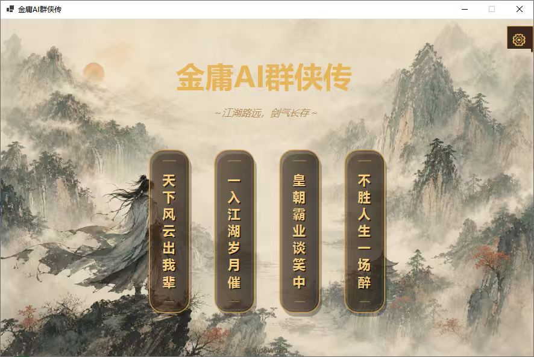
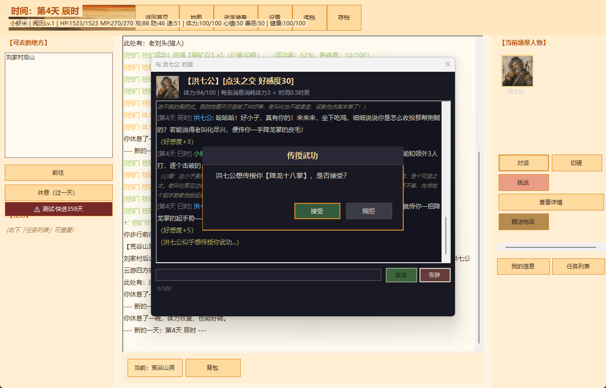
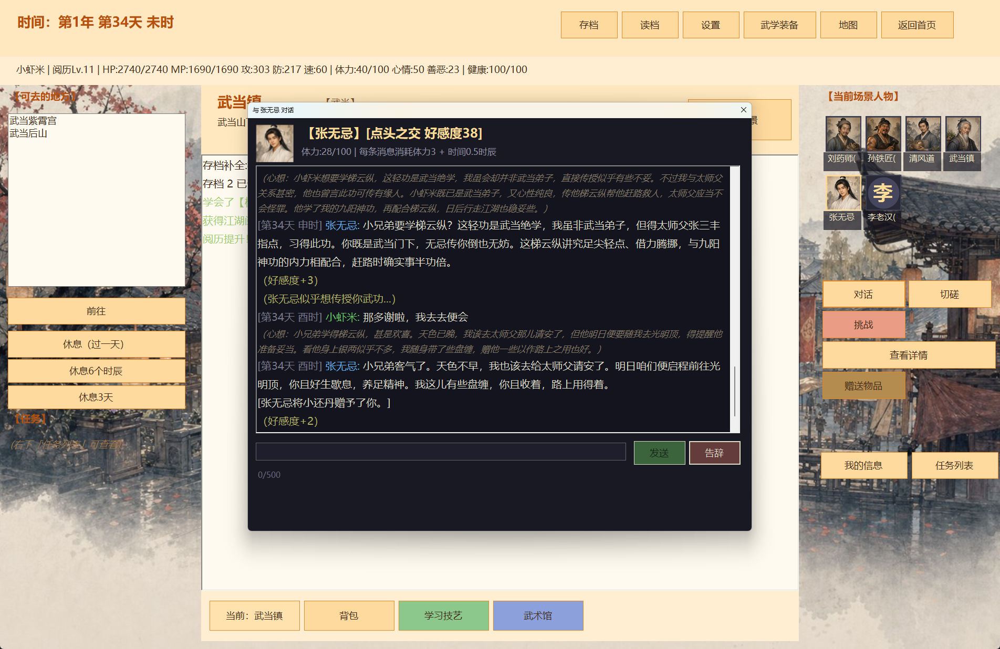

# AutoWuxia / 金庸群侠传-AI

一款 AI 驱动的单机武侠角色扮演游戏。你将从无名江湖人起步，在动态演化的武侠世界中游历城镇、门派与秘境；通过对话、切磋、战斗、任务和选择，走出自己的江湖路。

游戏以 JSON 配置驱动世界数据，并接入兼容 OpenAI 协议的 AI 服务：NPC 会根据性格、关系、经历和当前处境做出回应，生成更具变化的对话、行为与江湖事件。

## 交流反馈

QQ 群：**1053106102**

## 游戏内容

- **自由闯荡**：世界地图、城镇场景、赶路与时间流逝系统。
- **动态 NPC**：交谈、赠礼、切磋、拜师、门派关系与好感度。
- **武学与战斗**：内功、外功、轻功、装备、读条制战斗及多轮副本。
- **江湖成长**：主线与动态任务、门派任务、阅历、善恶、声望和人物经历。
- **生活玩法**：采药、挖矿、打猎、烹饪、炼药与锻造。
- **沉浸体验**：存读档、场景背景、人物头像、背景音乐和多倍率界面缩放。

## 游戏截图

| 首页 | 江湖对话与传授武功 |
| --- | --- |
|  |  |



## 技术栈

- C# / .NET 8 / WinForms
- JSON 配置驱动的游戏数据
- OpenAI 兼容 API

## 运行

安装 .NET 8 SDK 后，在项目根目录执行：

```powershell
dotnet restore
dotnet run --project src/AutoWuxia
```

首次启动后，请在游戏设置中填写 AI 服务的 Endpoint、API Key 和模型名称。配置与存档默认位于 `%AppData%\AutoWuxia`，不会提交到仓库。

## 开源与素材说明

原创代码以 [MIT License](LICENSE) 发布。武侠原著元素、角色与相关名称的权利归各自权利人所有；仓库内的音乐与图片等素材不属于 MIT 授权范围。素材的再分发与商用限制详见 [NOTICE.md](NOTICE.md)。

本项目为非商业、非官方的学习与同人创作项目，与任何原著权利人、出版方、影视方或游戏方无隶属、合作或授权关系。
